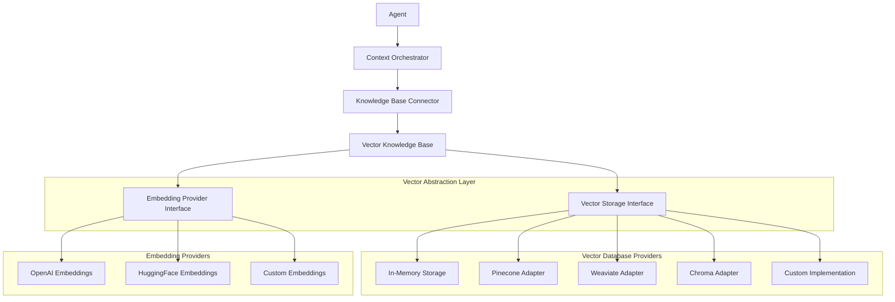

# Vector Database Integration Guide

## Overview

The Agento Framework provides a **flexible vector database abstraction system** that allows you to integrate any vector database without hardcoding specific implementations. This enables semantic search, enhanced context orchestration, and intelligent knowledge retrieval.

## Key Features

### 🔧 **Pluggable Architecture**
- Abstract interfaces for vector storage and embedding providers
- Support for multiple vector databases (Pinecone, Weaviate, Chroma, etc.)
- In-memory implementation for development and testing
- Easy to extend with custom implementations

### 🧠 **Intelligent Context Enhancement**
- Semantic search capabilities for context orchestration
- Vector-enabled knowledge base integration
- Hybrid search combining vector similarity and keyword matching
- Related concept discovery using vector embeddings

### 📊 **Production-Ready Features**
- Batch operations for efficient data ingestion
- Health checks and statistics monitoring
- Metadata filtering and advanced search options
- Error handling and resilience patterns

## Architecture



## Core Interfaces

### VectorStorage Interface

```typescript
interface VectorStorage {
  // Storage operations
  store(embedding: Omit<VectorEmbedding, 'timestamp'>): Promise<string>;
  storeBatch(embeddings: Array<Omit<VectorEmbedding, 'timestamp'>>): Promise<string[]>;
  
  // Search operations
  search(queryVector: number[], options?: VectorSearchOptions): Promise<VectorSearchResult[]>;
  searchByText(queryText: string, options?: VectorSearchOptions): Promise<VectorSearchResult[]>;
  
  // Management operations
  getById(id: string): Promise<VectorEmbedding | null>;
  updateMetadata(id: string, metadata: Record<string, any>): Promise<boolean>;
  delete(id: string): Promise<boolean>;
  deleteBatch(ids: string[]): Promise<boolean[]>;
  
  // Monitoring
  getStats(): Promise<{ totalCount: number; dimensions: number; lastUpdated?: Date; }>;
  healthCheck(): Promise<boolean>;
}
```

### EmbeddingProvider Interface

```typescript
interface EmbeddingProvider {
  generateEmbedding(text: string): Promise<number[]>;
  generateEmbeddings(texts: string[]): Promise<number[][]>;
  getDimension(): number;
  getModelName(): string;
}
```

## Quick Start Examples

### 1. In-Memory Vector Storage (Development)

Perfect for development, testing, and prototyping:

```typescript
import { VectorStorageFactory } from "../src/core/vector-storage.js";

// Create embedding provider
const embeddingProvider = VectorStorageFactory.createOpenAIEmbedding(
  process.env.OPENAI_API_KEY
);

// Create in-memory vector storage
const vectorStorage = VectorStorageFactory.createInMemory(embeddingProvider);

// Create vector-enabled knowledge base
const vectorKnowledgeBase = VectorStorageFactory.createVectorKnowledgeBase(
  vectorStorage,
  embeddingProvider
);

// Add content
await vectorKnowledgeBase.addContent(
  "React is a JavaScript library for building user interfaces.",
  { topic: "react", type: "definition" }
);
```

### 2. Pinecone Integration (Production)

Managed cloud vector database:

```typescript
import { VectorAdapterFactory } from "../src/core/vector-adapters.js";

// Create Pinecone adapter
const vectorStorage = VectorAdapterFactory.createPinecone({
  apiKey: process.env.PINECONE_API_KEY,
  environment: process.env.PINECONE_ENVIRONMENT,
  indexName: process.env.PINECONE_INDEX
});

// Create embedding provider
const embeddingProvider = VectorStorageFactory.createOpenAIEmbedding(
  process.env.OPENAI_API_KEY
);

// Create knowledge base wrapper
const knowledgeBase = new VectorKnowledgeBaseAdapter(vectorStorage, embeddingProvider);
```

### 3. Weaviate Integration (Self-hosted)

Open-source vector database:

```typescript
// Create Weaviate adapter
const vectorStorage = VectorAdapterFactory.createWeaviate({
  baseUrl: process.env.WEAVIATE_URL || 'http://localhost:8080',
  apiKey: process.env.WEAVIATE_API_KEY, // Optional for local instances
  className: 'AgentoKnowledge'
});

// Use HuggingFace embeddings for self-hosted setup
const embeddingProvider = VectorStorageFactory.createHuggingFaceEmbedding(
  process.env.HUGGINGFACE_API_KEY
);
```

### 4. Chroma Integration (Open Source)

Lightweight open-source vector database:

```typescript
// Create Chroma adapter
const vectorStorage = VectorAdapterFactory.createChroma({
  baseUrl: process.env.CHROMA_URL || 'http://localhost:8000',
  collectionName: 'agento_knowledge',
  apiKey: process.env.CHROMA_API_KEY // Optional
});
```

### 5. Jina AI Embeddings (Specialized)

High-quality embeddings optimized for search and retrieval:

```typescript
// Create Jina embedding provider
const embeddingProvider = VectorStorageFactory.createJinaEmbedding(
  process.env.JINA_API_KEY,
  'jina-embeddings-v2-base-en' // or jina-embeddings-v3, jina-clip-v1
);

// Use with any vector storage
const vectorStorage = VectorStorageFactory.createInMemory(embeddingProvider);
const knowledgeBase = new VectorKnowledgeBaseAdapter(vectorStorage, embeddingProvider);
```

### 6. Ollama Embeddings (Self-hosted)

Local embeddings with privacy and full control:

```typescript
// Create Ollama embedding provider
const embeddingProvider = VectorStorageFactory.createOllamaEmbedding(
  'http://localhost:11434', // Ollama server URL
  'nomic-embed-text'        // Embedding model
);

// Use with any vector storage
const vectorStorage = VectorStorageFactory.createInMemory(embeddingProvider);
const knowledgeBase = new VectorKnowledgeBaseAdapter(vectorStorage, embeddingProvider);
```

## Agent Integration

### Basic Setup

```typescript
import { Agent } from "../src/index.js";

// Create agent with vector-enabled context orchestration
const agent = new Agent({
  states,
  contexts,
  tools,
  defaultLLMConfig: llmConfig,
  contextOrchestratorConfig: {
    contextLLMConfig: llmConfig,
    maxContextTokens: 8000,
    enableSemanticClustering: true,
    relevanceThreshold: 0.3
  },
  knowledgeBaseConnector: knowledgeBase // Your vector knowledge base
});
```

### Advanced Configuration

```typescript
const contextOrchestratorConfig = {
  contextLLMConfig: llmConfig,
  maxContextTokens: 8000,
  maxReasoningHistory: 15,
  relevanceThreshold: 0.3,
  enableConceptMapping: true,
  enableSemanticClustering: true,
  timeDecayFactor: 0.1,
  
  // Vector-specific settings
  vectorSearchOptions: {
    limit: 5,
    minSimilarity: 0.4,
    includeMetadata: true
  },
  
  // Hybrid search weights
  vectorWeight: 0.7,
  keywordWeight: 0.3
};
```

## Creating Custom Implementations

### Custom Vector Storage

```typescript
class YourVectorStorage implements VectorStorage {
  async store(embedding: Omit<VectorEmbedding, 'timestamp'>): Promise<string> {
    // Your implementation here
    // - Connect to your vector database
    // - Store the embedding with metadata
    // - Return the ID
  }

  async search(queryVector: number[], options?: VectorSearchOptions): Promise<VectorSearchResult[]> {
    // Your implementation here
    // - Perform similarity search
    // - Apply filters if provided
    // - Return results with similarity scores
  }

  // Implement all other required methods...
}
```

### Custom Embedding Provider

```typescript
class YourEmbeddingProvider implements EmbeddingProvider {
  async generateEmbedding(text: string): Promise<number[]> {
    // Your implementation here
    // - Call your embedding model/service
    // - Return the embedding vector
  }

  async generateEmbeddings(texts: string[]): Promise<number[][]> {
    // Batch processing implementation
    // - More efficient than calling generateEmbedding multiple times
  }

  getDimension(): number {
    return 1536; // Your embedding dimension
  }

  getModelName(): string {
    return 'your-model-name';
  }
}
```

## Environment Configuration

### Environment Variables

Create a `.env` file with your vector database credentials:

```bash
# Vector Database Choice
VECTOR_METHOD=pinecone  # 'inmemory', 'pinecone', 'weaviate', 'chroma'

# OpenAI Embeddings
OPENAI_API_KEY=your_openai_api_key

# Pinecone Configuration
PINECONE_API_KEY=your_pinecone_api_key
PINECONE_ENVIRONMENT=us-west1-gcp-free
PINECONE_INDEX=agento-knowledge

# Weaviate Configuration
WEAVIATE_URL=http://localhost:8080
WEAVIATE_API_KEY=your_weaviate_api_key

# Chroma Configuration
CHROMA_URL=http://localhost:8000
CHROMA_API_KEY=your_chroma_api_key

# HuggingFace Embeddings
HUGGINGFACE_API_KEY=your_huggingface_api_key

# Jina AI Embeddings
JINA_API_KEY=your_jina_api_key

# Ollama Embeddings (Self-hosted)
OLLAMA_BASE_URL=http://localhost:11434
```

## Best Practices

### 1. **Choose the Right Vector Database**

- **Development/Testing**: Use in-memory storage
- **Small-Medium Scale**: Chroma (open-source, easy setup)
- **Large Scale/Production**: Pinecone (managed, highly scalable)
- **Self-hosted/Enterprise**: Weaviate (flexible, feature-rich)

### 2. **Embedding Strategy**

- **General Purpose**: OpenAI `text-embedding-3-small` (fast, good quality)
- **High Quality**: OpenAI `text-embedding-3-large` (slower, better quality)
- **Search Optimized**: Jina AI embeddings (specialized for retrieval tasks)
- **Self-hosted**: Ollama embeddings (privacy, full control, offline)
- **Cost-effective**: HuggingFace models (API-based, variety of models)
- **Domain-specific**: Fine-tuned models for your specific use case

### 3. **Content Organization**

```typescript
// Good metadata structure
const contentMetadata = {
  source: "documentation",
  topic: "react-hooks",
  type: "concept",
  difficulty: "intermediate",
  language: "javascript",
  lastUpdated: "2024-01-15",
  version: "18.2.0"
};

// Use consistent categorization
await knowledgeBase.addContent(content, contentMetadata);
```

### 4. **Search Optimization**

```typescript
// Use hybrid search for best results
const results = await knowledgeBase.hybridSearch(
  query,
  concepts,
  {
    limit: 5,
    minSimilarity: 0.3,
    vectorWeight: 0.7,     // Emphasize semantic similarity
    keywordWeight: 0.3,    // Include keyword matching
    filter: {
      topic: "react",      // Filter by metadata
      difficulty: "beginner"
    }
  }
);
```

### 5. **Performance Optimization**

```typescript
// Batch operations are more efficient
await knowledgeBase.addContentBatch([
  { content: "...", metadata: { ... } },
  { content: "...", metadata: { ... } },
  // ... more items
]);

// Use appropriate limits
const searchOptions = {
  limit: 5,              // Don't retrieve too many results
  minSimilarity: 0.3,    // Filter out irrelevant results
  includeMetadata: true  // Only if you need metadata
};
```

## Monitoring and Debugging

### Health Checks

```typescript
// Check vector storage health
const isHealthy = await vectorStorage.healthCheck();
console.log(`Vector storage healthy: ${isHealthy}`);

// Get statistics
const stats = await vectorStorage.getStats();
console.log(`Total vectors: ${stats.totalCount}`);
console.log(`Dimensions: ${stats.dimensions}`);
```

### Debug Information

```typescript
// Enable context orchestration insights
const result = await agent.processQuery(userId, query, sessionId);

if (result.contextOrchestrationResult) {
  const orchestration = result.contextOrchestrationResult;
  console.log(`Strategy: ${orchestration.contextStrategy}`);
  console.log(`Relevance: ${orchestration.totalRelevanceScore}`);
  console.log(`Vector contexts: ${orchestration.selectedContexts.length}`);
}
```

## Migration Guide

### From Hardcoded to Pluggable

**Before** (hardcoded):
```typescript
// Fixed Pinecone implementation
const pineconeClient = new PineconeClient();
// ... hardcoded Pinecone logic
```

**After** (pluggable):
```typescript
// Abstract interface
const vectorStorage: VectorStorage = VectorAdapterFactory.createPinecone(config);
// ... same logic works with any provider
```

### Switching Vector Databases

Simply change the environment variable:

```bash
# Switch from Pinecone to Chroma
# VECTOR_METHOD=pinecone
VECTOR_METHOD=chroma
```

The application code remains the same!

## Troubleshooting

### Common Issues

1. **"Embedding dimension mismatch"**
   - Ensure your vector database index dimension matches your embedding provider
   - OpenAI `text-embedding-3-small`: 1536 dimensions
   - OpenAI `text-embedding-3-large`: 3072 dimensions

2. **"Vector storage connection failed"**
   - Check your API keys and connection URLs
   - Verify the vector database is running and accessible
   - Test with health check: `await vectorStorage.healthCheck()`

3. **"Search returns no results"**
   - Lower the `minSimilarity` threshold
   - Check if content was properly indexed
   - Verify metadata filters are not too restrictive

4. **"Slow search performance"**
   - Reduce the search limit
   - Use metadata filters to narrow the search space
   - Consider upgrading to a more powerful vector database tier

### Debug Commands

```typescript
// Test embedding generation
const embedding = await embeddingProvider.generateEmbedding("test query");
console.log(`Embedding dimension: ${embedding.length}`);

// Test vector storage
const testId = await vectorStorage.store({
  id: 'test-001',
  vector: embedding,
  content: 'Test content',
  metadata: { type: 'test' }
});
console.log(`Stored with ID: ${testId}`);

// Test search
const results = await vectorStorage.search(embedding, { limit: 1 });
console.log(`Found ${results.length} results`);
```

## Examples

See the complete example implementations in:
- `examples/vector-integration-example.ts` - Full integration examples
- `examples/context-orchestration-example.ts` - Context orchestration with vectors
- `test-framework.ts` - Testing without API calls

## Next Steps

1. **Start with in-memory storage** for development
2. **Choose your production vector database** based on scale and requirements
3. **Implement your embedding strategy** (OpenAI, HuggingFace, or custom)
4. **Add content to your knowledge base** with rich metadata
5. **Configure context orchestration** to leverage vector search
6. **Monitor and optimize** based on your use case

The vector abstraction system ensures your application remains flexible and can adapt to changing requirements without code changes - just configuration updates! 